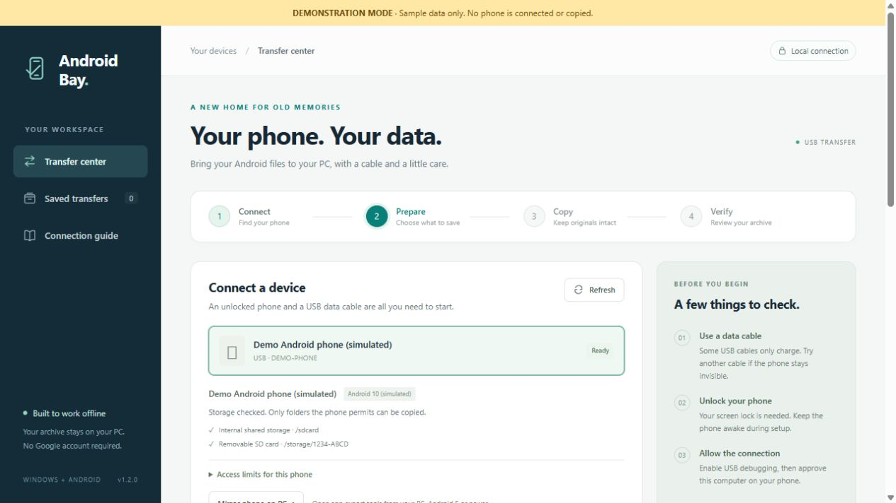

# Android Bay

**Bring your old phone's data safely ashore.**



*Preview uses synthetic demo data only.*

Android Bay is a portable Windows app for copying accessible data from an unlocked Android phone over USB, then reading the saved archive on your PC. **No Google account or cloud upload required.** The app and phone helper work without the Play Store or a phone internet connection.

**[Download the Windows app](https://github.com/Accessibility-Labs/android-bay/releases/latest)** · [How it works](#quick-start) · [What it can save](#what-it-can-save) · [Credits](CREDITS.md)

> The first packaged Windows release is not published yet; source is available now. When the release is available, download **AndroidBay-Windows-x64.zip** from its assets. GitHub's automatically generated “Source code” ZIP does not include the portable runtime and tools.

## Why Android Bay?

- Copy photos, videos, audio, documents, downloads and other accessible shared files.
- Export SMS, MMS and attachments, contacts, call logs and calendars with the included phone helper.
- Read saved conversations and browse media without reconnecting the phone.
- Stop and resume transfers, check saved-file hashes, and review a coverage report explaining missing data.
- Inspect accessible retained trash and location metadata in separate reports.
- Keep the workflow local: no telemetry, remote scripts, cloud upload or online map lookup.

Android Bay is an independent community project. It is not affiliated with or endorsed by Google. It uses established Android tools and APIs; it does not bypass a screen lock, root a phone, or recover everything on every device.

## Requirements

- Windows 10 or 11, **64-bit**, with room for the app and your archive.
- An Android phone you own or are authorized to access, unlocked and with USB debugging enabled.
- A USB **data** cable. Some charging cables cannot transfer data.
- Android 4.4 or newer for the helper; Android 5 or newer for screen mirroring. Device policies and Android versions can restrict individual features.

You do not need to install Python, Node.js or WSL to use the portable release. Some phones require their manufacturer's official Windows USB driver.

## Quick start

1. **Download and extract.** Get `AndroidBay-Windows-x64.zip` from [Releases](https://github.com/Accessibility-Labs/android-bay/releases/latest). Extract the entire `AndroidBay` folder to a local drive. Open **Launch.cmd**. Keep the PC awake while copying.
2. **Connect the phone.** Unlock it and connect the data cable. On the phone, open **Settings → About phone → Build number** and tap seven times. Samsung may place Build number under **Software information**. Open **Developer options → USB debugging**, turn it on, and approve your computer on the phone. Enter any PIN on the phone itself.
3. **Select it.** In Android Bay, choose **Transfer center → Refresh → your phone**. Wait for the inspection.
4. **Prepare messages and contacts.** Click **Install phone helper → Open helper on phone**. In **Android Bay Helper**, tap **Grant permissions**, allow the categories you want, then **Create export**. Keep the helper open until it says **Export finished**. This installs an app and creates export files on the phone; it does not delete the original records.
5. **Choose your destination.** Click **Browse…** and choose a folder with enough free space. Keep **Files & media**, **Installed apps** and **Phone data exports** selected as appropriate. Under **Advanced options**, review **Device activity and settings** and the other methods before using them.
6. **Copy.** Click **Start transfer**. Keep the phone connected. Wait for copying and the subsequent archive checks to finish. **Stop transfer** preserves completed copies; **Resume transfer** continues that phone's saved job.
7. **Verify.** Click **Verify saved files → Open coverage report**. Open important saved files and make another backup before retiring or resetting the phone.

Use **Stop.cmd** to shut down the local app after any active transfer is cancelled. **Preview Demo.cmd** runs a clearly labeled synthetic demonstration that never reads a phone.

## Read messages and browse media

Open **Saved transfers → Read messages & media** for the transfer you want. On the first visit, click **Build archive index** if prompted.

- **Messages:** select a conversation; search names, numbers or message text. **Load more messages**, **First page** and **Last page** handle long conversations.
- **Photos**, **Videos** and **Audio:** browse recognized saved files and available MMS attachments. Use **Save original file** if your browser cannot play a format.
- **All saved files:** inspect the complete catalog, including files the reader does not interpret.

The reader uses your PC copies and keeps source references. It does not modify raw exports. After resuming a transfer, use **Rebuild local index** if prompted. Private chat databases and encrypted backups are not automatically decoded.

## What it can save

| Category | What to expect |
| --- | --- |
| Shared files | Accessible internal/removable storage: photos, videos, music, downloads, documents and hidden shared files. Android may deny folders. |
| Messages and personal records | Helper exports visible SMS/MMS, MMS attachments, contacts, contact photos, call history and calendars after permission. RCS is not SMS/MMS. |
| Installed apps | App inventory and readable APK installers, including splits. An APK is not the app's private data or login session. |
| App-created backups | Copies backups saved in accessible storage. Use the original app's own export when available. |
| Retained trash | Checks accessible MediaStore trash and recognized trash paths. A candidate path alone does not prove deletion. This is not erased-block recovery. |
| Location data | Reads GPS metadata and supported route/location exports already available in the archive. No geocoding or uploads. Coordinates do not establish a person's presence. |
| Device activity | Optional bounded captures of information Android exposes, such as recent logs, usage records and selected settings. Available history varies and can be incomplete. |
| Advanced methods | Optional legacy ADB backups, permitted debuggable-app access, or existing root access. Each has device-specific limits. The app does not root or unlock a bootloader. |

**There is no “all data recovered” guarantee.** Encrypted/private app storage, cloud-only records, overwritten files, secure hardware keys and other profiles may be inaccessible. A phone is live while copying, so this is not a forensic disk image or an atomic database snapshot. PC hashes detect later changes to saved bytes; they do not prove every phone file was visible.

## Troubleshooting

| Symptom | Try this |
| --- | --- |
| Phone missing | Unlock it, use another data cable/USB port, select File transfer if needed, then Refresh. Check the manufacturer's USB driver. |
| Unauthorized | Approve the USB debugging prompt on the phone. |
| Offline | Reconnect the cable, unlock the phone, and refresh. |
| Empty message export | Check the helper's permissions, create a fresh export and wait for completion. Review the coverage report for denied providers. |
| Helper installation blocked | Device management or a newer Android version may reject the legacy-compatible helper. Review the reported error; the app does not bypass those restrictions. Shared-file copying may still work. |
| Missing private app history | Use that app's built-in export. Being signed into an app does not grant Android Bay access to its private database. |
| Large file will not save | Use NTFS or exFAT; FAT32 cannot store individual files larger than 4 GB. Check free space and the report. |
| Location history missing | Only accessible saved data is analyzed. Some services require an export from their original app or account. |

## Privacy

Your phone data stays in the destination you choose. The desktop UI listens only on `127.0.0.1`; actions require a random local token. The helper declares no Internet permission. Archives are **not encrypted by Android Bay**; use a protected account or encrypted drive if you need encryption.

**Never attach a recovery folder, message export, contact list, location report, device log or unredacted screenshot to a public issue.** Use synthetic examples and remove identifiers from error reports. See [SECURITY.md](SECURITY.md).

The public repository and release contain application code, synthetic test fixtures and vendor software only. Recovery archives, local state, personal media, real-device reports and signing keys are excluded.

## Development

The desktop app uses the Python standard library; the helper is native Java. See [DEVELOPMENT.md](DEVELOPMENT.md) for dependencies, helper builds and release packaging.

From an extracted portable release:

```powershell
.\runtime\python.exe -m unittest discover -s tests -v
.\runtime\python.exe server.py --demo --no-browser
```

[VALIDATION.md](VALIDATION.md) records checks on the published build and their limits. Bug reports should identify Windows/Android versions, the app version, a sanitized error, and reproduction steps.

## Credits

Android Bay depends on **[ADB / the Android Open Source Project](https://android.googlesource.com/platform/packages/modules/adb/)**, **[Genymobile's scrcpy](https://github.com/Genymobile/scrcpy)**, **[Phil Harvey's ExifTool](https://github.com/exiftool/exiftool)** and **[Python](https://github.com/python/cpython)**.

Design references include [Open Android Backup](https://github.com/mrrfv/open-android-backup), [Android-Archiver](https://github.com/mirbyte/Android-Archiver), [SMS Import / Export](https://github.com/tmo1/sms-ie), [Amaze File Manager](https://github.com/TeamAmaze/AmazeFileManager) and Timeline export parsers. See [CREDITS.md](CREDITS.md) for authors, usage and source links.

## License

Android Bay's original code is licensed under the [MIT License](LICENSE). You can use, modify and redistribute it, including commercially, provided you retain the copyright and license notice. It is provided without warranty.

Bundled third-party software is covered by its own licenses, not by Android Bay's MIT license. See [THIRD-PARTY-NOTICES.txt](THIRD-PARTY-NOTICES.txt) and [third-party/README.md](third-party/README.md) for component terms, included notices and corresponding source. The portable release includes FFmpeg and libusb under LGPL-2.1-or-later, with matching source archives in `third-party/sources/`. Keep those materials when redistributing the bundle.
